<div align="center">


# Pixel to Prediction

**Draw a digit. Watch a real convolutional network take it apart, one layer at a time.**

### [Try it →](https://rkcr7.github.io/pixel-to-prediction/)

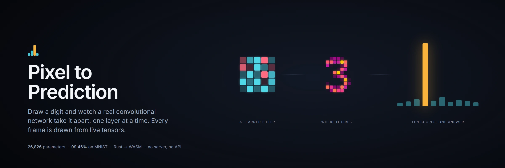

[](#the-test-that-actually-matters)
[](#the-model)
[](#how-it-is-built)
[](LICENSE)

</div>

---

Everything on screen is a number the network actually produced. No pre-rendered video, no
faked layers, no stock "AI glow". The filters sweeping across your drawing are the trained
5x5 weights. The heat on each feature map is that map's real activation. The sentence at
the end is composed from gradients computed in your browser, in about two milliseconds.

It runs entirely on your device. There is no server, no API key, and nothing about your
drawing leaves the page.

## The thing that makes this different

Most CNN visualisations hand a model to an inference runtime, get logits back, and draw a
diagram around them. That works right up until you want to show what happens *inside*,
because every runtime throws the intermediates away, and the intermediates are the whole
product here.

So there is no runtime. The forward pass **and the backward pass** are written from
scratch in Rust. One crate does three jobs:

1. trains the model natively, with rayon
2. runs inference in the browser through WASM, keeping every intermediate tensor
3. computes real gradient attribution live, which is what the closing explanation is built from

Same code on both sides, so there is no train/serve skew, and nothing has to be
approximated for the sake of the picture.

---

## The seven stages

The whole walkthrough is about 57 seconds, and every frame below is a real capture.

### 2. Preparing the input

Your drawing is cropped to the ink, scaled into a 20 pixel box, and re-centred on its
centre of mass. This is the actual MNIST normalisation, shown step by step, because a
network trained on centred digits will quietly fail on uncentred ones.

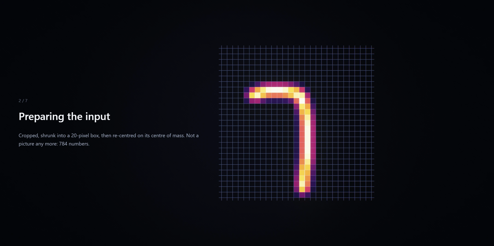

### 3. First look

One learned filter reads across the image and writes its response as it goes. The point of
holding on a single filter is that it never changes: the same 25 numbers are applied at
every position, which is the part of convolution that people report not getting from
animations.

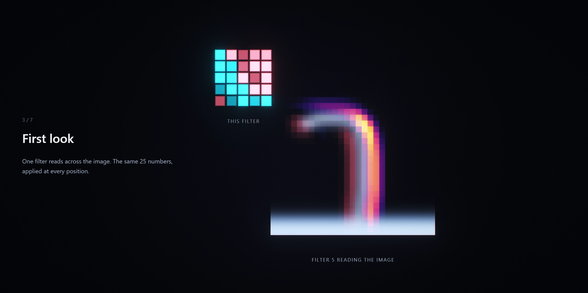

Then the other seven resolve, staggered by how strongly each one fired rather than by
index, so the order of appearance is itself information.

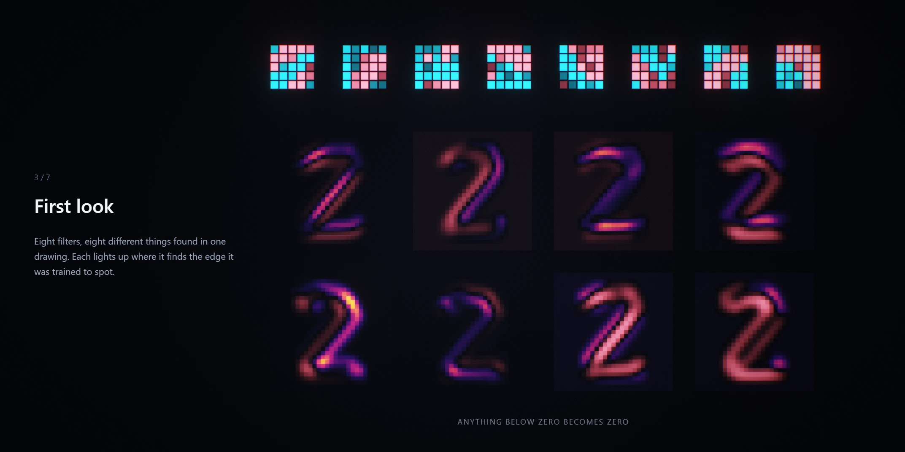

### 4. Finding shapes

Pooling is invisible at grid scale, so the camera comes back to one map for it. Each 2x2
block keeps only its brightest cell, and the picture halves.

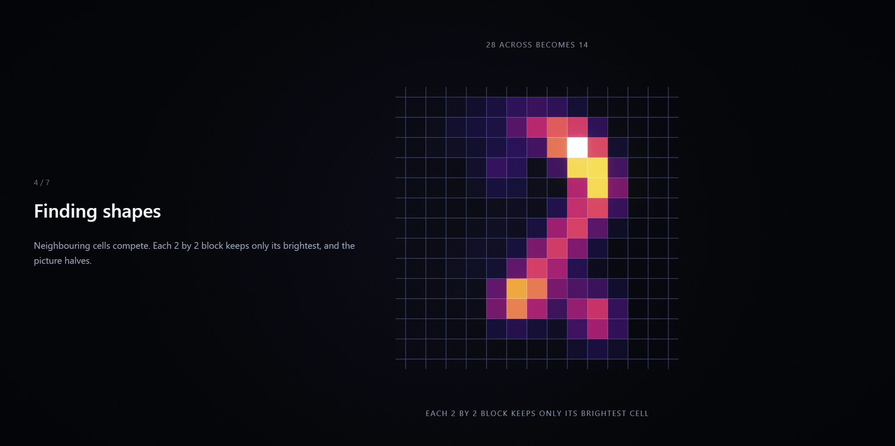

Then sixteen richer features, built by combining the eight simple ones and ranked by how
hard each fired.

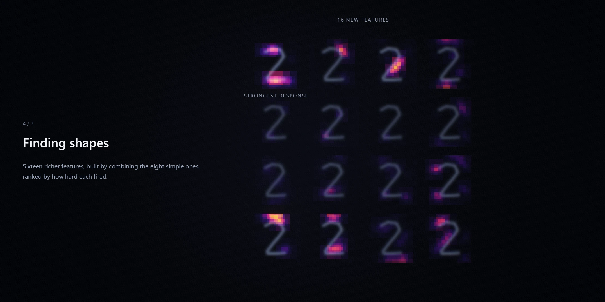

### 5. Matching possibilities

A dense layer is where most explainers give up and draw a hairball of lines. This one picks
a single hidden unit and works it through in full: the 784 weights it holds reshape onto
exactly the same grid as the pooled features, so the dot product can be *drawn* rather than
asserted. What the unit wants, what your digit has, and where the two agree.

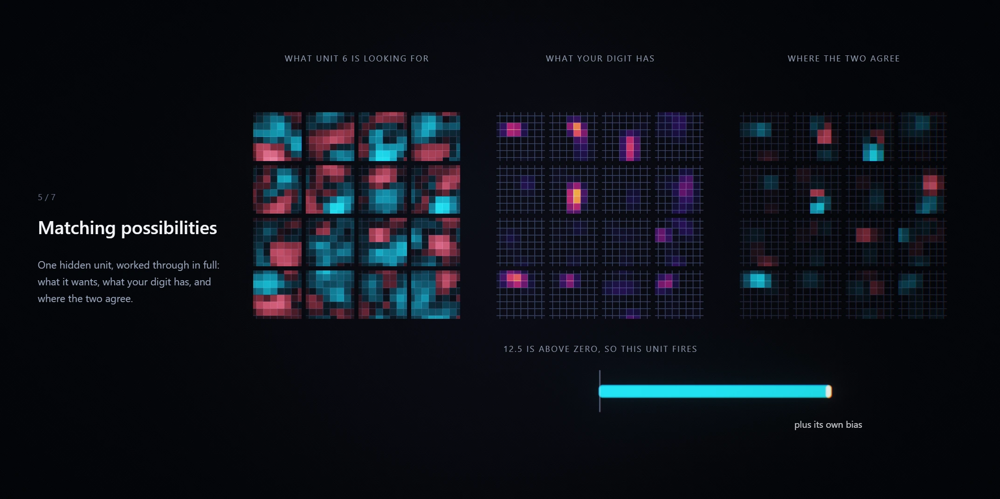

A Rust test pins that the agreement panel really does sum to the unit's reported
pre-activation, so the picture cannot drift away from the number.

Then all 32 units, voting on all ten digits at once. Cyan argues for, coral argues against.

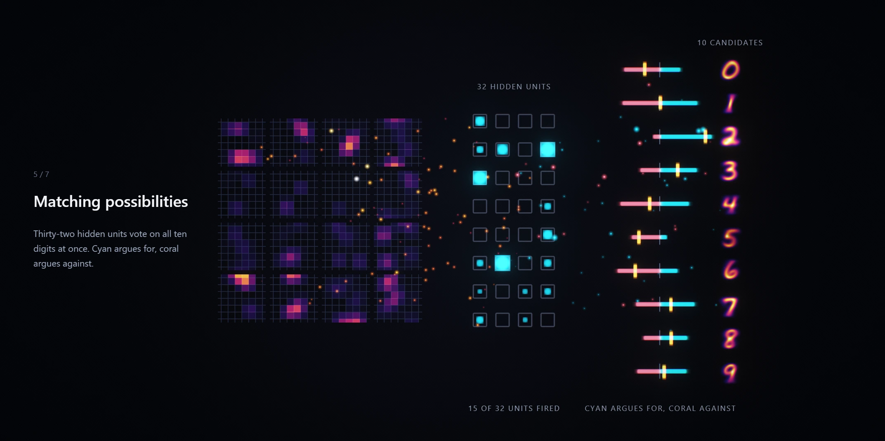

### 6. The decision

Ten raw scores. Half of them negative, and they do not add up to anything yet.

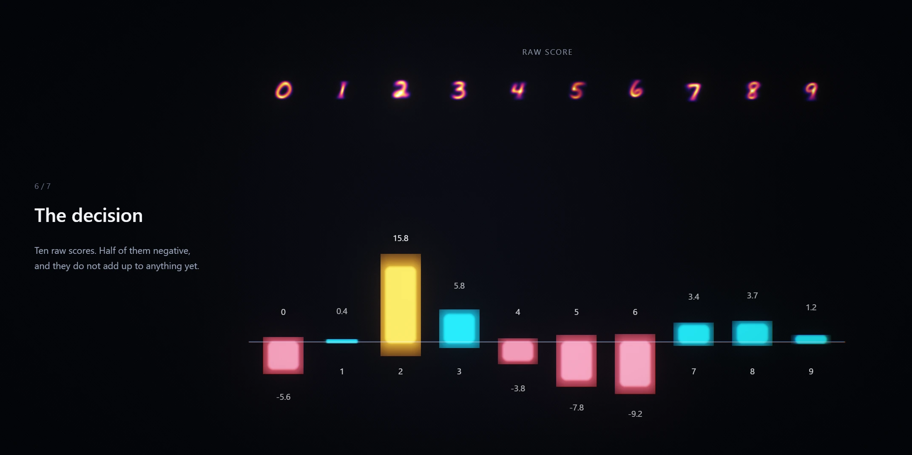

Exponentiate to stretch the gaps, then split one single unit of certainty between them.
That container is drawn as an actual object, because "the bars got taller" and "one fixed
budget was divided ten ways" look identical otherwise.

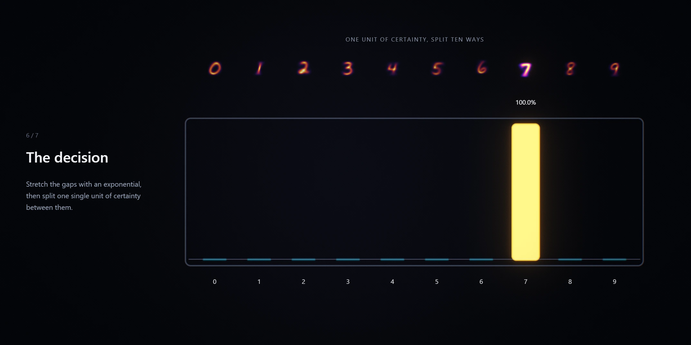

### 7. The answer

Your ink in cool grey, with warm attribution on top: warm where a pixel argued for the
answer, cool where it argued against. These are real gradients, not a decorative glow.

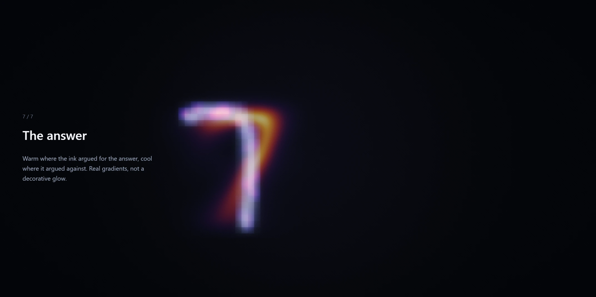

---

## Two details worth calling out

**ReLU is drawn honestly.** Positive values look *identical* before and after, because ReLU
does not touch them. Only the negative half changes, and it is extinguished rather than
dimmed. Plenty of explainers make the survivors brighter, which teaches the wrong thing.

**The explanation is measured, not templated.** Rust returns facts (per-region attribution,
enclosed loop count, logit margin) and the UI does the phrasing. When the evidence is
genuinely diffuse it says so, instead of inventing a tidy reason.

---

## The model

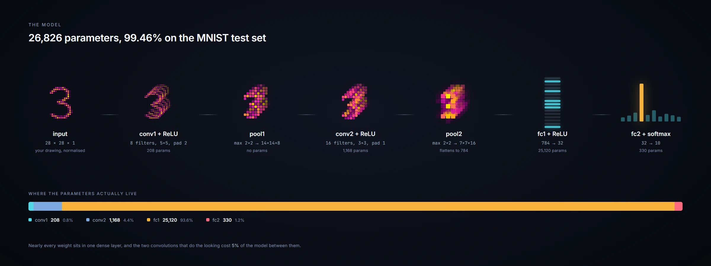

```
input      28x28x1
conv1      8 filters, 5x5, pad 2   ->  28x28x8   -> ReLU        208 params
pool1      max 2x2                 ->  14x14x8
conv2      16 filters, 3x3, pad 1  ->  14x14x16  -> ReLU      1,168 params
pool2      max 2x2                 ->  7x7x16
fc1        784 -> 32               -> ReLU                   25,120 params
fc2        32 -> 10                -> softmax                   330 params
                                                       total 26,826 params
```

**99.46% on the MNIST test set**, after 32 epochs from seed 1234.

Some of those choices are for the visualisation rather than the leaderboard, and that is
deliberate:

- **5x5 in conv1, not 3x3.** A 5x5 kernel rendered on screen reads as a recognisable
  oriented edge detector. A 3x3 one is visual mush.
- **8 filters then 16.** Eight is the most you can show large and individually readable at
  once. Sixteen tiles as a 4x4 grid and reads as "more, and more abstract".
- **No batch norm.** Every operation in the graph has to be explainable in one plain
  sentence, and batch norm is not.

---

## Running it

```bash
git clone https://github.com/Rkcr7/pixel-to-prediction && cd pixel-to-prediction
bash scripts/build.sh          # rust tests, wasm, typecheck, production bundle
cd web && npx vite preview     # or: npx vite  for the dev server
```

The trained weights are committed, so a normal build does not need MNIST.

To retrain from scratch:

```bash
bash scripts/train.sh          # downloads MNIST, trains, exports web/public/model
```

The trainer refuses to export below 99.3% test accuracy, so a bad run cannot silently
ship, and it prints the full confusion matrix so a regression in one digit cannot hide
behind a good headline number.

**Requirements:** Rust stable with the `wasm32-unknown-unknown` target, `wasm-pack`, and
Node 20+.

---

## How it is built

```
crates/nnviz/          Rust: tensors, conv/pool/dense forward AND backward,
                       MNIST preprocessing, saliency, the native trainer,
                       and the wasm bindings. 47 unit tests.
web/src/core/          Deterministic timeline, easing, palette, wasm loader
web/src/gl/            WebGL2 renderer, written directly (no Three.js)
web/src/scene/         Layout, choreography, per-frame drawing
web/src/ui/            Drawing surface, annotations, copy generation
web/src/audio/         Procedural sound, synthesised at runtime
```

**Total transfer is about 187 KB gzipped**, including the model weights and the WASM.

A few decisions that shaped the rest:

**The timeline is a pure function of time.** No animated value accumulates. `sample(t)`
recomputes everything from clip definitions, so scrubbing backward is bit-identical to
playing forward, speed changes are free, and a recorded clip matches what you watched
exactly.

**WebGL2, not WebGPU.** WebGPU still has gaps on Firefox/Linux and older Android. The
actual GPU load here is trivial. A project that lives or dies on being shareable cannot
exclude a chunk of phones for nothing.

**No Three.js.** This is a 2.5D compositing problem, not a 3D scene. A scene graph is the
wrong abstraction and the bytes are better spent elsewhere.

**Text never covers the picture.** The annotation layer measures each label and nudges it
back inside the frame, and the scene fades a label out once the thing it names has left the
shot. Both rules exist because a caption printed over a feature map is worse than no
caption at all.

---

## The test that actually matters

```bash
cargo test --lib
```

47 tests, and two of them carry the project:
`input_gradient_matches_numeric_gradient` and
`parameter_gradients_match_numeric_gradient`. They compare the analytic backward pass
against a central-difference approximation through the whole network.

If backprop had a sign error or a misindexed kernel, the app would still run, still look
beautiful, and every explanation it showed a user would be confidently wrong. Nothing on
screen would look broken. A numerical gradient check is the only thing that catches that.

---

## Accessibility and behaviour

- Full keyboard control: space to play or pause, arrows to step between stages, enter to reveal
- `prefers-reduced-motion` skips straight to the answer
- Sound is synthesised, off-switchable, and remembers your choice
- Adaptive render scale driven by the median of recent frame times, with hysteresis
- Works on touch, and the layout reflows for portrait

---

## Licence

MIT. See [LICENSE](LICENSE).

MNIST is by Yann LeCun, Corinna Cortes and Christopher Burges. The trained weights in this
repository are produced by `scripts/train.sh` and are reproducible from the seed recorded
in `web/public/model/model.json`.

The mark is four columns of pixels that are also a bar chart with one winner: the losers
stay as separate squares because they are still unresolved, the winner is one continuous
bar because it is not. It has no text and no filters, so it survives a favicon, an avatar,
and a sanitiser. Source: [`logo.svg`](.github/assets/logo.svg).

The banner, the architecture diagram and the share cards are built with
[HyperFrames](https://hyperframes.heygen.com); their compositions are in
[`.github/assets/sources/`](.github/assets/sources) and re-render with
`hyperframes snapshot`. Every other image is a real capture of the app, composed from the
scene's own label list so the annotations sit exactly where the renderer put them.

Share cards, if you need them:
[square](.github/assets/social-square.webp) (1080x1080) and
[vertical](.github/assets/social-vertical.webp) (1080x1920).
