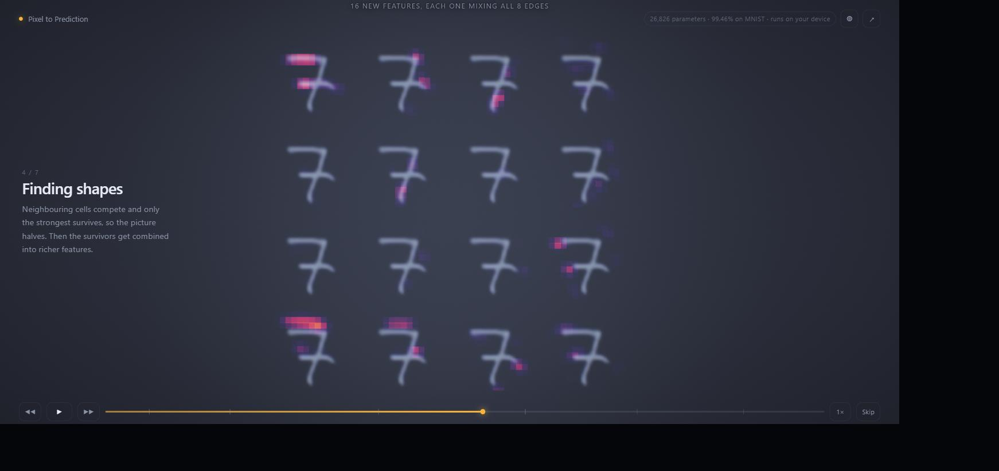
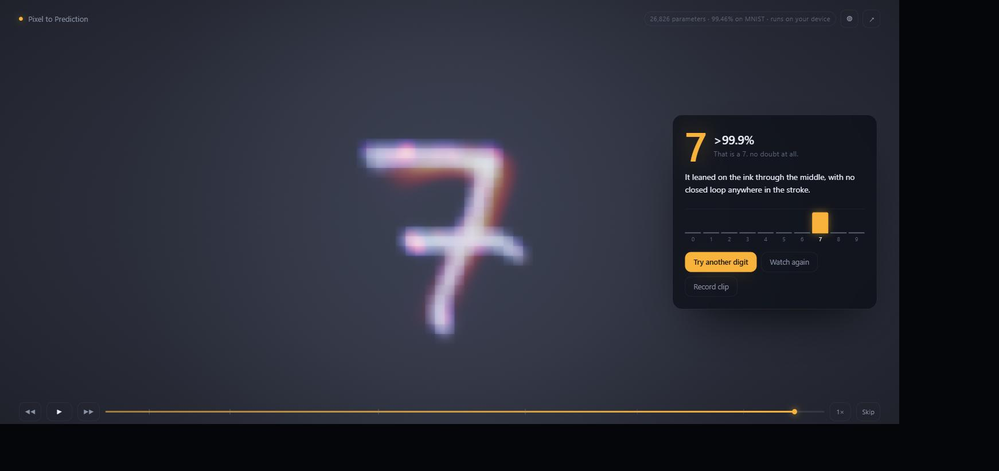

# Pixel to Prediction

**Draw a digit. Watch a real convolutional network take it apart, one layer at a time.**

Everything on screen is a number the network actually produced. No pre-rendered video, no
faked layers, no stock "AI glow". The filters you see sweeping across your drawing are the
trained 5x5 weights. The heat on each feature map is that map's real activation. The
sentence at the end is composed from gradients computed in your browser, in about two
milliseconds.



---

## The thing that makes this different

Most CNN visualisations hand a model to an inference runtime, get logits back, and draw a
diagram around them. That works right up until you want to show what happens *inside*,
because every runtime throws the intermediates away.

So there is no runtime here. The forward pass **and the backward pass** are written from
scratch in Rust. That single crate does three jobs:

1. trains the model natively, with rayon
2. runs inference in the browser through WASM, keeping every intermediate tensor
3. computes real gradient attribution live, which is what the closing explanation is built from

Same code on both sides, so there is no train/serve skew, and nothing has to be
approximated for the sake of the picture.

---

## What you actually see

| Stage | What is on screen | Where the numbers come from |
| --- | --- | --- |
| 1. Your digit | Your drawing, full size | The canvas |
| 2. Preparing the input | Crop to the ink, scale to a 20px box, re-centre on the centre of mass | The real MNIST normalisation, step by step |
| 3. First look | One learned filter sweeps down the image writing its response, then all eight resolve, then ReLU extinguishes every negative value | `conv1` pre-activation, so the negative half exists to be destroyed |
| 4. Finding shapes | A 2x2 pooling close-up, then sixteen second-layer maps over a ghost of your digit | `pool1`, `conv2`, ranked by activation energy |
| 5. Matching possibilities | 784 features into 32 hidden units into 10 candidates, cyan arguing for and coral arguing against | `weight x activation` per edge, ranked |
| 6. The decision | Ten raw scores, then exponentiated, then split into one unit of certainty | `logits`, `exp(logit - max)`, `softmax` |
| 7. The answer | Your ink in cool grey with warm attribution on top | `d(logit)/d(input) x input` |



### Two details worth calling out

**ReLU is drawn honestly.** Positive values look *identical* before and after, because
ReLU does not touch them. Only the negative half changes, and it is extinguished rather
than dimmed. Plenty of explainers make the survivors brighter, which teaches the wrong
thing.

**The explanation is measured, not templated.** Rust returns facts (per-region attribution,
enclosed loop count, logit margin) and the UI does the phrasing. When the evidence is
genuinely diffuse it says so instead of inventing a tidy reason.

---

## The model

```
input      28x28x1
conv1      8 filters, 5x5, pad 2   ->  28x28x8   -> ReLU        208 params
pool1      max 2x2                 ->  14x14x8
conv2      16 filters, 3x3, pad 1  ->  14x14x16  -> ReLU      1,168 params
pool2      max 2x2                 ->  7x7x16
fc1        784 -> 32               -> ReLU                   25,120 params
fc2        32 -> 10                -> softmax                   330 params
                                                       total 26,826 params
```

**99.46% on the MNIST test set.** Trained in 126 seconds on eight cores.

Some of those choices are for the visualisation rather than the leaderboard, and that is
deliberate:

- **5x5 in conv1, not 3x3.** A 5x5 kernel rendered on screen reads as a recognisable
  oriented edge detector. A 3x3 one is visual mush.
- **8 filters then 16.** Eight is the most you can show large and individually readable at
  once; sixteen tiles as a 4x4 grid and reads as "more, and more abstract".
- **No batch norm.** Every operation in the graph has to be explainable in one plain
  sentence, and batch norm is not.

---

## Running it

```bash
git clone <this repo> && cd viusalizer
bash scripts/build.sh          # rust tests, wasm, typecheck, production bundle
cd web && npx vite preview     # or: npx vite  for the dev server
```

The trained weights are committed, so a normal build does not need MNIST.

To retrain from scratch:

```bash
bash scripts/train.sh          # downloads MNIST, trains, exports web/public/model
```

The trainer refuses to export below 99.3% test accuracy, so a bad run cannot silently
ship, and it prints the full confusion matrix so a regression in one digit cannot hide
behind a good headline number.

### Requirements

Rust stable with the `wasm32-unknown-unknown` target, `wasm-pack`, and Node 20+.

---

## How it is built

```
crates/nnviz/          Rust: tensors, conv/pool/dense forward AND backward,
                       MNIST preprocessing, saliency, the native trainer,
                       and the wasm bindings. 43 unit tests.
web/src/core/          Deterministic timeline, easing, palette, wasm loader
web/src/gl/            WebGL2 renderer, written directly (no Three.js)
web/src/scene/         Layout, choreography, per-frame drawing
web/src/ui/            Drawing surface, annotations, copy generation
web/src/audio/         Procedural sound, synthesised at runtime
```

**Total transfer is about 190 KB gzipped**, including the model weights and the WASM.

A few decisions that shaped the rest:

**The timeline is a pure function of time.** No animated value accumulates. `sample(t)`
recomputes everything from clip definitions, so scrubbing backward is bit-identical to
playing forward, speed changes are free, and a recorded clip matches what you watched
exactly.

**WebGL2, not WebGPU.** WebGPU reaches roughly 70% of browsers and still has gaps on
Firefox/Linux and older Android. The actual GPU load here is trivial. A project that lives
or dies on being shareable cannot exclude a third of phones for nothing.

**No Three.js.** This is a 2.5D compositing problem, not a 3D scene. A scene graph is the
wrong abstraction and the bytes are better spent elsewhere.

---

## Tests

```bash
cargo test --lib
```

The two that matter most are `input_gradient_matches_numeric_gradient` and
`parameter_gradients_match_numeric_gradient`. They compare the analytic backward pass
against a central-difference approximation through the whole network.

If backprop had a sign error or a misindexed kernel, the app would still run, still look
beautiful, and every explanation it showed a user would be confidently wrong. Nothing on
screen would look broken. A numerical gradient check is the only thing that catches that.

---

## Accessibility and behaviour

- Full keyboard control: space to play or pause, arrows to step between stages, enter to reveal
- `prefers-reduced-motion` skips straight to the answer
- Sound is synthesised, off-switchable, and remembers your choice
- Adaptive render scale driven by the median of recent frame times, with hysteresis
- Works on touch, and the layout reflows for portrait

---

## Licence

MIT. See [LICENSE](LICENSE).

MNIST is by Yann LeCun, Corinna Cortes and Christopher Burges. The trained weights in this
repository are produced by `scripts/train.sh` and are reproducible from the seed recorded
in `web/public/model/model.json`.
